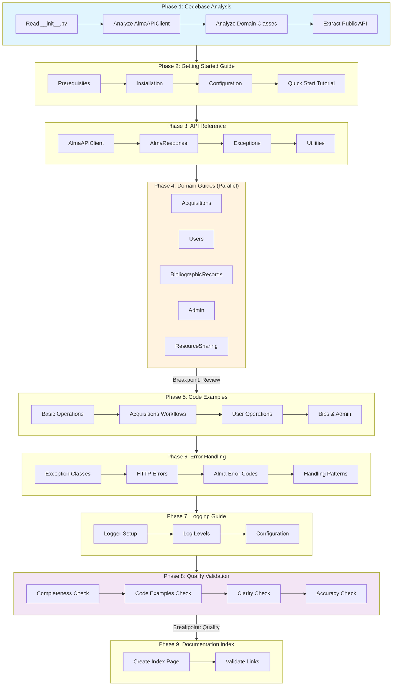

# AlmaAPITK Documentation Process Diagram



## Process Overview

| Phase | Description | Output |
|-------|-------------|--------|
| 1. Codebase Analysis | Analyze package structure and public API | Analysis report |
| 2. Getting Started | Installation, config, quick start | `getting-started.md` |
| 3. API Reference | Document all public classes | `api-reference.md` |
| 4. Domain Guides | Document each domain class (parallel) | 5 domain guide files |
| 5. Code Examples | Common workflows and examples | `examples.md` |
| 6. Error Handling | Exception handling guide | `error-handling.md` |
| 7. Logging | Logging configuration guide | `logging.md` |
| 8. Quality Validation | Check documentation quality | Quality report |
| 9. Index | Create navigation and index | `index.md` |

## Breakpoints

1. **After Phase 4**: Review domain guides before continuing
2. **After Phase 8**: Review quality score before finalizing

## Expected Output Structure

```
docs/
├── index.md
├── getting-started.md
├── api-reference.md
├── examples.md
├── error-handling.md
├── logging.md
└── domains/
    ├── acquisitions.md
    ├── users.md
    ├── bibliographicrecords.md
    ├── admin.md
    └── resourcesharing.md
```
