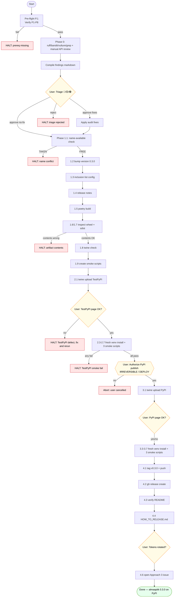

# pypi-publish-0.3.0 Flow

```mermaid
flowchart TD
    Start([Start]) --> P[Pre-flight P.1<br/>Verify P1-P8]
    P -- fail --> Halt1[HALT: prereq missing]
    P -- pass --> Audit[Phase 0: ruff/bandit/vulture/grep + manual API review]
    Audit --> Compile[Compile findings markdown]
    Compile --> BP1{User: Triage 🔴/🟡/🟢}
    BP1 -- approve fixes --> Fix[Apply audit fixes]
    BP1 -- approve no-fix --> P1
    BP1 -- reject --> HaltA[HALT: triage rejected]
    Fix --> P1[Phase 1.1: name-available check]
    P1 -- TAKEN --> HaltN[HALT: name conflict]
    P1 -- FREE --> P12[1.2 bump version 0.3.0]
    P12 --> P13[1.3 inclusion list config]
    P13 --> P14[1.4 release notes]
    P14 --> P15[1.5 poetry build]
    P15 --> P16[1.6/1.7 inspect wheel + sdist]
    P16 -- contents wrong --> Halt16[HALT: artifact contents]
    P16 -- contents OK --> P18[1.8 twine check]
    P18 --> P19[1.9 create smoke scripts]
    P19 --> P21[2.1 twine upload TestPyPI]
    P21 --> BP2{User: TestPyPI page OK?}
    BP2 -- no --> HaltT[HALT: TestPyPI defect, fix and rerun]
    BP2 -- yes --> P23[2.3-2.7 fresh venv install + 3 smoke scripts]
    P23 -- any fail --> HaltSmoke[HALT: TestPyPI smoke fail]
    P23 -- all pass --> BP3{{"User: Authorize PyPI publish<br/>IRREVERSIBLE / DEPLOY"}}
    BP3 -- no --> Abort[Abort: user cancelled]
    BP3 -- yes --> P31[3.1 twine upload PyPI]
    P31 --> BP4{User: PyPI page OK?}
    BP4 -- yes/no --> P33[3.3-3.7 fresh venv install + 3 smoke scripts]
    P33 --> P41[4.1 tag v0.3.0 + push]
    P41 --> P42[4.2 gh release create]
    P42 --> P43[4.3 verify README]
    P43 --> P44[4.4 HOW_TO_RELEASE.md]
    P44 --> BP5{User: Tokens rotated?}
    BP5 --> P46[4.6 open Approach 3 issue]
    P46 --> Done([Done — almaapitk 0.3.0 on PyPI])

    classDef bp fill:#fffbe6,stroke:#fa8c16,color:#000
    classDef halt fill:#ffe5e5,stroke:#cf1322,color:#000
    classDef done fill:#e6ffed,stroke:#389e0d,color:#000
    class BP1,BP2,BP3,BP4,BP5 bp
    class Halt1,HaltA,HaltN,Halt16,HaltT,HaltSmoke,Abort halt
    class Done done
```
