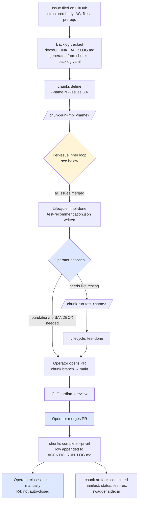
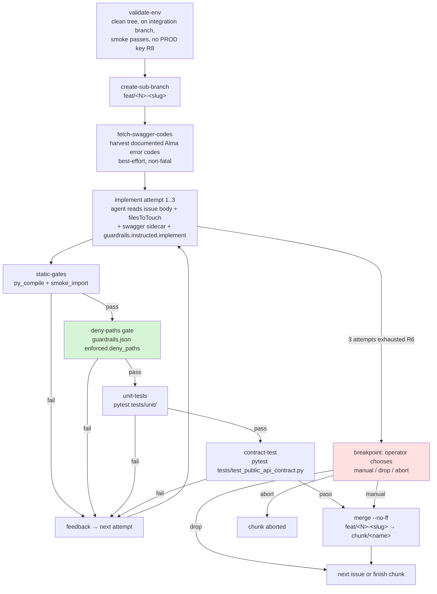

# Issue-Handling Pipeline

**Status:** current as of 2026-05-06 (after PRs #105, #106, #107).

Diagram + reference for the full lifecycle of a GitHub issue in this repo, from filing through merge and closure. Captures the chunk-driven implementation flow (`docs/superpowers/specs/2026-05-03-chunk-driven-implementation-design.md`), the operator playbook (`docs/CHUNK_PLAYBOOK.md`), and the new guardrails registry (`docs/superpowers/plans/2026-05-06-guardrails-registry-phase-1.md`).

---

## Top-level pipeline



Boxes shaded blue are operator decision points. The yellow box expands into the inner gate loop below.

---

## Per-issue inner loop (inside `chunk-run-impl`)

Driven by `.a5c/processes/chunk-template-impl.js#process`. For every issue in the chunk's `manifest.json`, this sub-flow runs:



The green box is the **deny-paths gate** introduced by Phase 1 of the guardrails registry — replaces the prior `scope-check` allow-list.

The red box is the only operator-blocking breakpoint in the inner loop (R6 cap).

---

## Where each rule fires

The `R*` rules from `CLAUDE.md` and the design spec map to specific stages of the pipeline:

| Rule | Stage where enforced | Mechanism |
|---|---|---|
| **R1** Chunk integration branch is `chunk/<name>` | `validate-env`, `create-sub-branch` | git-level checks |
| **R2** Sub-branches are `feat/<N>-<slug>` | `create-sub-branch` | shell command |
| **R3** Pipeline is human-paced — no auto-trigger | top-level flow (operator must invoke `/chunk-run-impl`, `/chunk-run-test`, `chunks complete`) | CLAUDE.md session-start protocol |
| **R4** Issues are closed manually after merge | post-merge, **not** in the chunk-impl loop | operator runs `gh issue close` after merge |
| **R5** SANDBOX state-changes carry cleanup | `chunk-run-test` (separate process) | test-recommendation schema enforces it |
| **R6** 3-attempt cap on refinement | inner loop | `maxAttempts` in chunk-template-impl.js; breakpoint on exhaustion |
| **R7** No edits to deny-listed paths | **`deny-paths` gate** (Phase 1 of guardrails) | `scripts/agentic/guardrails.py` + `guardrails.json` |
| **R8** No `ALMA_PROD_API_KEY` in environment | `chunks` CLI entry (refuses to start), `validate-env` | shell guard |
| **R9** No real identifiers in committed/published content | every commit, every PR/issue body | author discipline + (Phase 3) regex enforcement |
| **R10** Bug-driven regression tests | per-incident workflow | author discipline; `regression-smoke` cumulative suite |

---

## Guardrails registry — current and planned

The registry at the repo root (`guardrails.json`) is the single source of truth for mechanical rules and stage-routed instructions. It evolves in phases:

| Phase | Status | What it adds |
|---|---|---|
| **1** | ✅ shipped (PR #106) | `enforced.deny_paths` + `denyPathsTask`. Replaces R7 scope-check. Stub `instructed.implement` and `instructed.critique` arrays for future use. |
| **2** | planned | Diff-size budget gate (`enforced.diff_budget`). Commit-message regex (`enforced.commit_message`). |
| **3** | planned | R9 mechanical redaction (`enforced.redaction.forbidden_patterns`) over commit messages, PR bodies, issue comments. |
| **4** | planned | Critique-pass agent (new pipeline stage). Reads diff against AC and `instructed.critique` rules; flags scope creep that file-level gates miss. |
| **5** | planned | Remove `files_to_touch` from `manifest.json` and from issue bodies. Delete `scripts/agentic/scope_check.py` and its tests (kept in tree through Phase 1-4 for back-compat). |

Phase 1 schema:

```json
{
  "version": 1,
  "enforced": {
    "deny_paths": [".github/", "secrets/"]
  },
  "instructed": {
    "implement": [],
    "critique": []
  }
}
```

`enforced.*` rules are mechanical (deterministic, gated by the harness, fast, journal-logged). `instructed.*` rules will be rendered into the relevant stage's agent prompt — so the implement agent gets only `instructed.implement`, the critique agent gets only `instructed.critique`. Stage-routing keeps each prompt tight.

---

## Operator decision points (where humans intervene)

| Trigger | Default action | When to deviate |
|---|---|---|
| Session start in this repo | Run `chunks list`, surface dashboard | — |
| Chunk defined | Run `/chunk-run-impl <name>` | Defer if not ready (R3 — never auto-trigger) |
| R6 breakpoint after 3 failed attempts | Decide `manual` / `drop` / `abort` | — |
| Chunk reaches `impl-done` | For foundation tickets: skip to PR. For tickets with live AC: run `/chunk-run-test <name>` first | foundation-only chunks (no SANDBOX endpoints) skip live test |
| Chunk reaches `test-done` (or PR-ready directly) | Open PR via `gh pr create`, base = `main` | — |
| PR security check + review complete | Merge with `gh pr merge --merge` | — |
| PR merged | Run `chunks complete <name> --pr-url <url>` | — |
| Chunk in `merged` state | Close the GitHub issue manually with `gh issue close <N>` | R4 — only if every AC is genuinely satisfied; otherwise leave open with a summary comment |

---

## Lifecycle states

`chunks/<name>/status.json` carries the chunk's stage. The terminal states are `merged` and `aborted`.

```mermaid
stateDiagram-v2
    [*] --> defined: chunks define
    defined --> impl-running: chunks run-impl
    impl-running --> impl-done: all gates green for every issue
    impl-running --> aborted: operator aborts at breakpoint
    impl-done --> test-running: chunks run-test (optional)
    impl-done --> merged: PR merged + chunks complete<br/>(foundation tickets skip test)
    test-running --> test-done: SANDBOX tests pass
    test-running --> aborted: cleanup failure or operator abort
    test-done --> merged: PR merged + chunks complete
    merged --> [*]
    aborted --> [*]
```

---

## Files behind the pipeline

| File | Role |
|---|---|
| `scripts/agentic/chunks` | Operator CLI (bash). Subcommands: `list`, `status`, `next`, `define`, `run-impl`, `run-test`, `abort`, `complete`, `render-backlog`, `reconcile`, `regression-smoke`. |
| `scripts/agentic/issue_parser.py` | Parses GitHub issue bodies into structured manifest fields. Strips inline annotations from backticked file paths (PR #105). |
| `scripts/agentic/guardrails.py` | Loads `guardrails.json`, runs `match_deny_paths`, exposes the `deny-paths` CLI for the chunk-impl process (PR #106). |
| `scripts/agentic/scope_check.py` | **Deprecated** (PR #106). Retained for back-compat through Phase 5. |
| `scripts/agentic/prompts/implement.v1.md` | Implementing-agent prompt template. R7 was softened in PR #106 — `filesToTouch` is now guidance, not a hard gate. |
| `scripts/agentic/prompts/test-recommendation.v1.md` | Test-plan-author agent prompt template. |
| `.a5c/processes/chunk-template-impl.js` | Babysitter process driving the chunk-impl iterations. |
| `.a5c/processes/chunk-template-test.js` | Babysitter process driving the SANDBOX testing pass. |
| `chunks/<name>/manifest.json` | Per-chunk: list of issues with parsed bodies, AC, files, prereqs. |
| `chunks/<name>/status.json` | Per-chunk: lifecycle state, last event, next action. |
| `chunks/<name>/test-recommendation.json` | Per-chunk: test plan written by the planner agent. |
| `guardrails.json` | Repo-level: source of truth for mechanical rules + future stage-routed instructions. |
| `docs/CHUNK_BACKLOG.md` | Generated from `docs/chunks-backlog.yaml`; phase-ordered list of chunks. |
| `docs/AGENTIC_RUN_LOG.md` | Append-only run log; one row per finished chunk. |
| `docs/CHUNK_PLAYBOOK.md` | Operator playbook. |

---

## What changed in 2026-05-06's three PRs

| PR | What it did |
|---|---|
| **#105** `fix/parser-strip-inline-annotation` | `issue_parser._bullet_lines` now strips ` (annotation)` suffix from inside backticked file paths. Fixed false-positive scope-check rejections on foundation tickets like #22 where the issue body has `` `path/to/file.py (NEW)` ``. R10 regression tests added. |
| **#106** `feat/guardrails-registry-phase-1` | Introduced `guardrails.json`. New `denyPathsTask` replaces the prior `scopeCheckTask` in the chunk-impl process. R7 reframed from allow-list to deny-list. `files_to_touch` stays as guidance, not a hard gate. `scope_check.py` marked deprecated. |
| **#107** `chunk/config-bootstrap` | Issue #22: foundation Configuration domain class + public-API plumbing + 14 unit tests + CLAUDE.md update. First chunk to run end-to-end on the new pipeline. |

---

## Cross-references

- Hard rules and origin: [`CLAUDE.md`](../CLAUDE.md)
- Design spec: [`docs/superpowers/specs/2026-05-03-chunk-driven-implementation-design.md`](superpowers/specs/2026-05-03-chunk-driven-implementation-design.md)
- Operator playbook: [`docs/CHUNK_PLAYBOOK.md`](CHUNK_PLAYBOOK.md)
- Phase 1 guardrails plan: [`docs/superpowers/plans/2026-05-06-guardrails-registry-phase-1.md`](superpowers/plans/2026-05-06-guardrails-registry-phase-1.md)
- Backlog: [`docs/CHUNK_BACKLOG.md`](CHUNK_BACKLOG.md) (generated from `docs/chunks-backlog.yaml`)
- Run history: [`docs/AGENTIC_RUN_LOG.md`](AGENTIC_RUN_LOG.md)
